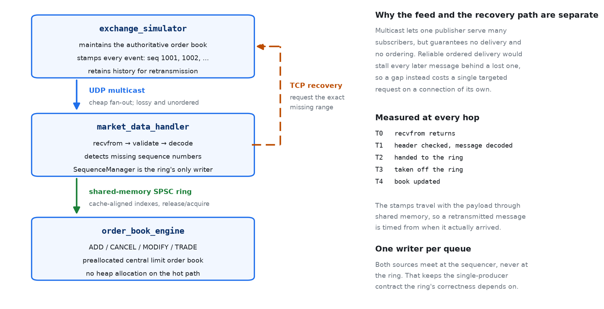
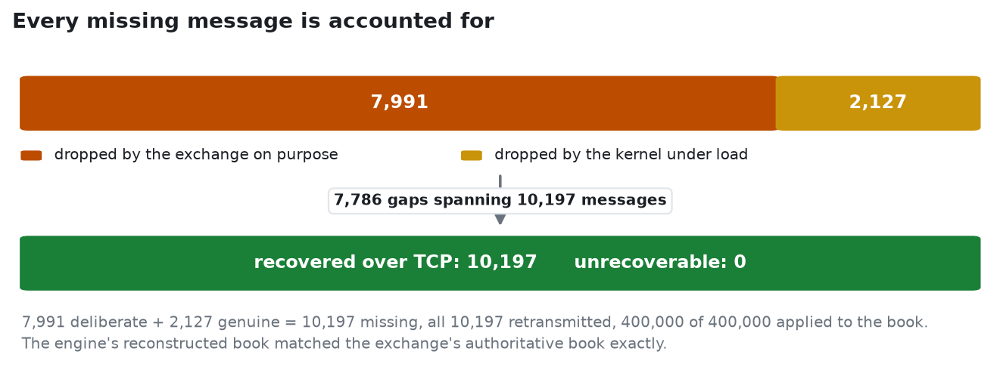
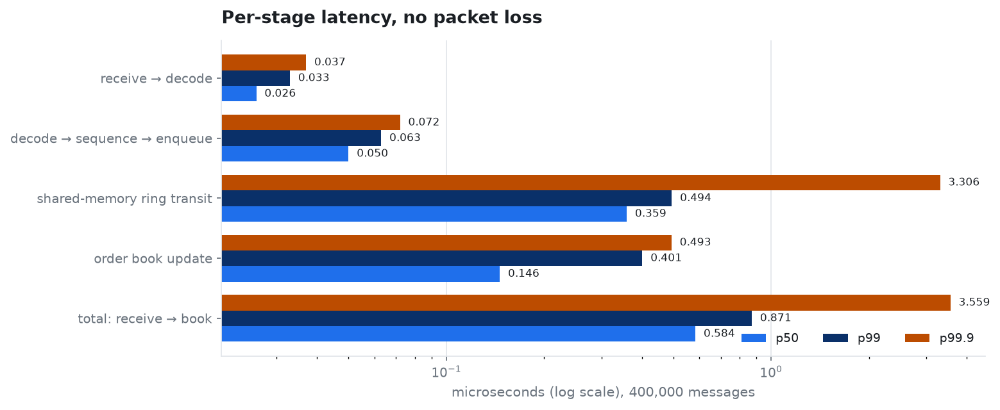
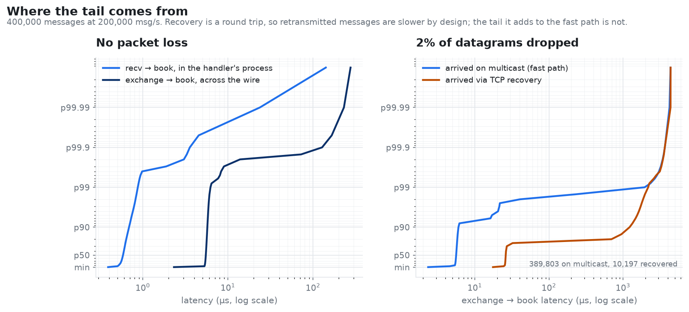
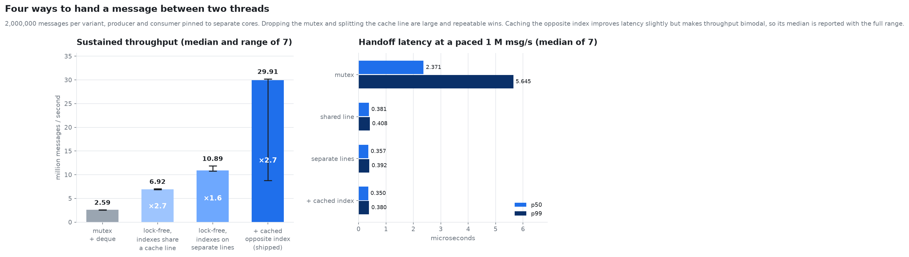
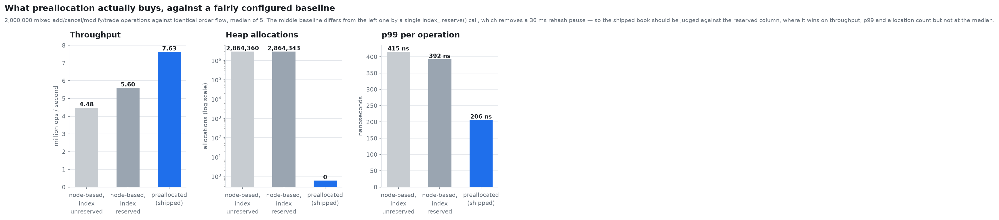

# Low-Latency Market Data Engine

[](https://github.com/BruceMoseti/C-Low-Latency-Trading-Systems-Engine/actions/workflows/ci.yml)

A market-data pipeline in C++20 for Linux, built the way an exchange feed actually
works: an exchange simulator publishes sequenced order-book events over UDP
multicast, a handler process detects missing sequence numbers and repairs them over
a separate TCP connection, and an order-book process consumes the repaired stream
through a shared-memory ring buffer and maintains a preallocated central limit order
book. Every hop is timestamped, so the pipeline is characterised by its tail — p99
and p99.9 — rather than by an average.



Three processes, two transports, one shared-memory queue:

| Process | Responsibility |
| --- | --- |
| `exchange_simulator` | generates order flow, maintains the authoritative book, assigns sequence numbers, publishes the feed and heartbeats, serves retransmissions |
| `market_data_handler` | joins the group, validates and decodes packets, detects gaps, requests the missing range over TCP, emits one ordered stream |
| `order_book_engine` | applies add/cancel/modify/trade to a preallocated book and reports the latency of every stage |

## Quick start

Needs Linux, CMake 3.20+ and a C++20 compiler. The engine, the tests and the
benchmarks have no third-party dependencies; only the optional figure script needs
matplotlib.

```bash
./scripts/build.sh                    # configure and build into ./build
ctest --test-dir build                # 3 suites, ~33k assertions
./scripts/check_pipeline.sh --messages 200000 --rate 200000 --drop-rate 0.02
```

That last command starts all three processes, drops 2% of the datagrams on purpose,
and then checks that the book the engine rebuilt is the book the exchange actually
had:

```
pipeline check: messages=200000 rate=200000 drop-rate=0.02 batch=1 seed=42

  ok    engine book digest matches exchange            913e586912865030
  ok    engine best bid matches exchange               18749
  ok    engine best ask matches exchange               18751
  ok    engine live order count matches exchange       89114
  ok    handler published every message                200000
  ok    engine consumed every message                  200000
  ok    engine applied every message                   200000
  ok    every gap was recovered                        3909
  ok    no message abandoned                           0
  ok    nothing dropped at shutdown                    0
  ok    no malformed packet                            0
  ok    no unknown order referenced                    0
  ok    no out-of-band price                           0
  ok    no over-filled order                           0

PASS  book digest 913e586912865030 matches the exchange; 3909 of 3909 missing
      messages recovered over TCP
```

The digest is the assertion that matters. It covers every occupied level on both
sides plus the id, quantity and queue position of every resting order, so two books
with the same digest hold the same orders at the same prices in the same order. The
touch price and the live count are also compared, but on their own they are far too
weak: this simulator keeps every level occupied, so the best bid and ask are pinned
at 18749/18751 and would match even with thousands of messages missing.

The gap count moves between runs, because on top of the injected drops the host
loses a variable number of datagrams of its own. What does not move is the digest.

## How it works

### The protocol

One fixed-layout 48-byte struct carries every event. It is memcpy'd onto the wire
with no serialization step, since both sides are built from the same source on the
same host, and every field offset is pinned by `static_assert` — a size check alone
would not catch two same-width fields being swapped, and the layout *is* the
protocol.

```cpp
struct MarketMessage {
    std::uint64_t sequence_number;   // gap detection hangs off this
    std::uint64_t timestamp_ns;      // publish time, travels with retransmissions
    std::uint64_t order_id;
    Price         price;             // int64 ticks, never floating point
    std::uint32_t quantity;
    std::uint32_t symbol_id;
    MessageType   type;              // Add / Cancel / Modify / Trade / Heartbeat
    Side          side;
    std::uint16_t reserved;
};
```

`$187.53` is stored as `18753`. Binary floating point cannot represent most decimal
prices exactly, so money in a book belongs in integers; it also makes price
comparison and the price-to-level index trivial.

A datagram carries an 8-byte header and up to 32 messages. Batching amortises the
`sendto` syscall; the receiver accepts any count within bounds and rejects anything
whose declared length disagrees with the bytes received.

### Two transports, on purpose

Market data goes out over UDP multicast because one publisher can serve many
subscribers without tracking any of them. The cost is that UDP guarantees nothing:
the receiver will see `1001, 1002, 1004` and has to notice.

Running the feed over TCP instead would make that impossible, but at a price that
matters more: a single lost segment stalls everything behind it while the kernel
retransmits, so one drop delays every later message. Splitting the paths means a gap
costs one targeted request for one range, on a connection of its own, while the live
feed keeps flowing.

### Heartbeats, because silence is ambiguous

A gap is normally exposed by the message that arrives after it. That leaves one case
uncoverable: if the *last* messages are lost, nothing arrives behind them, and a
receiver cannot tell "the feed went quiet" from "I missed the end of it".

So the exchange publishes a heartbeat carrying the next sequence number it will
assign, periodically and as a short burst when the stream ends. A heartbeat consumes
no sequence number and never reaches the book; it just tells the handler how far the
feed has got, which turns a trailing loss into an ordinary gap. The handler also
sweeps for holes when the feed goes idle, in case the heartbeat that would have
revealed one was itself dropped.

This matters more than it sounds. Without it, a loss in the final datagram is
invisible: the missing-message and unrecoverable counters both stay at zero, so the
run reports a clean bill of health while the book is quietly wrong. It showed up as
roughly a 2% failure rate across randomly seeded runs at 2% loss — and it failed as
a *flake*, which is the worst way for a correctness bug to present. CI now sweeps
several seeds for exactly this reason.



### One writer per queue

The handler and the engine are separate processes sharing a ring buffer through
`shm_open` and `mmap`, so this is genuinely inter-process, not two threads described
with borrowed vocabulary.

The ring is single-producer, single-consumer. That is a correctness constraint, not a
performance note, and it shapes the design: the natural way to add recovery is to let
the recovery path publish downstream alongside the receive path, which quietly puts
two writers on a queue built for one. Instead both sources feed the `SequenceManager`,
and the sequencer is the only thing that ever writes to the ring. The two paths
converge *before* the queue, never at it.

Ownership is enforced across processes too, not just across threads. A second handler
on the same segment is refused rather than allowed to silently share it, and the
segment records its creator's pid so a process exiting only unlinks a mapping that is
still its own — `shm_unlink` removes by name, and without that check a producer
shutting down can delete a segment a later producer created under the same name.

Three details carry the performance:

**The indexes live on separate cache lines.** The producer writes `write_idx_`, the
consumer writes `read_idx_`. Adjacent in memory they share a 64-byte line, and the
two cores then invalidate each other's copy on every single operation despite never
touching the same variable. `alignas(64)` separates them, and each sits beside that
side's private cached copy of the opposite index — so the common case does not read
the other core's line at all.

**The slots do too.** Aligning only the start of the ring's storage still leaves
adjacent slots sharing a line, and in the near-empty steady state the producer writes
slot N while the consumer reads slot N−1 — exactly the pair that would then contend.
`PipelineEvent` is padded to 128 bytes so a slot never shares a line with its
neighbour.

**Publication is release/acquire.** The producer fills the slot and then publishes the
index with a release store; the consumer acquires the index before reading the slot.
That pairing is what guarantees the consumer cannot observe a published index while
the payload writes that preceded it are still invisible.

### The order book

Price-time priority, with every container sized in the constructor:

- price levels in a flat array indexed by `price - min_price`, so finding a level is
  an offset rather than a tree descent
- orders from a fixed pool threaded on an intrusive free list, and an intrusive
  doubly-linked list per level, which makes cancel an O(1) unlink
- `order_id` to pool slot through an open-addressed table using backward-shift
  deletion, so it needs neither tombstones nor the rehash pause they eventually force
- best bid and ask tracked incrementally, scanning outward only when a touch level
  empties

Modify follows venue semantics: holding or shrinking at the same price keeps time
priority, while a price change or a size increase sends the order to the back of its
new queue. A fill larger than the resting quantity is reported as `OverFilled`
rather than absorbed as a clean full fill — it can only happen if an Add or Modify
never arrived, which makes it the clearest desync signal the feed offers.

## Results

All numbers below come from the logs committed under
[`docs/measurements/`](docs/measurements), on an 8-core Linux container with `-O2` and
processes pinned. The figures are generated from those same logs by
`scripts/make_figures.py`, and CI fails if regenerating them produces any change.

### The book reconstructs exactly

400,000 messages at 200,000 msg/s. With the exchange dropping 2% of datagrams, the
accounting closes with nothing left over:

| | injected drops | kernel drops | missing | recovered | abandoned | applied |
| --- | --- | --- | --- | --- | --- | --- |
| 400,000 messages, 2% loss | 7,991 | 2,206 | 10,197 | 10,197 | 0 | 400,000 |

The kernel drops are real, not simulated: the exchange put 392,009 data datagrams on
the wire and the handler received 389,803 of them, so 2,206 were lost by the host
under load. Added to the 7,991 deliberate drops that is exactly the 10,197 gaps the
handler reported. Every one was retransmitted, and both processes finished holding
the same book — digest `9c199374da16c565` on both sides.

### Latency through the pipeline



| stage | p50 | p90 | p95 | p99 | p99.9 |
| --- | --- | --- | --- | --- | --- |
| receive → decode † | 0.026 µs | 0.026 µs | 0.032 µs | 0.033 µs | 0.037 µs |
| decode → sequence → enqueue | 0.050 µs | 0.055 µs | 0.060 µs | 0.063 µs | 0.072 µs |
| shared-memory ring transit | 0.359 µs | 0.396 µs | 0.448 µs | 0.494 µs | 3.306 µs |
| order book update | 0.146 µs | 0.220 µs | 0.277 µs | 0.401 µs | 0.493 µs |
| **total: receive → book** ‡ | **0.584 µs** | **0.687 µs** | **0.742 µs** | **0.871 µs** | **3.559 µs** |
| exchange → book, across the wire ‡ | 5.486 µs | 5.718 µs | 5.817 µs | 6.224 µs | 127.6 µs |

† **At the measurement floor; not a result.** Each stage boundary is a
`clock_gettime(CLOCK_MONOTONIC)` call, and two back-to-back reads cost 24 ns on this
machine — `benchmarks/timer_overhead` measures it and the number is committed in
[`timer_overhead.log`](docs/measurements/timer_overhead.log). A stage reported at
26 ns is describing the instrumentation, not the decode. The honest statement is that
decoding costs less than the clock can see.

‡ **The totals include the instrumentation between them.** `t4 − t0` spans three
further clock reads, so roughly 70 ns of each total is the cost of decomposing it.
Removing the intermediate stamps drops the in-process p50 by about 17%. The stage
breakdown and the total cannot both be free; the breakdown is worth its overhead, and
the overhead is stated rather than netted out.

The ring transit tail is the weak point, and it is scheduler jitter rather than
queueing: the consumer spins on an empty ring, and when the host deschedules it the
next message waits. On a machine with isolated cores it would mostly disappear.
Nothing here is tuned — no core isolation, no busy-poll networking, no huge pages.

### What synchronous recovery costs

Splitting end-to-end latency by how each message arrived shows a trade-off worth
naming.



| loss rate | gaps | fast path p99 | fast path p99.9 | recovery p50 | recovery p90 |
| --- | --- | --- | --- | --- | --- |
| none | 0 | 6.224 µs | 127.6 µs | — | — |
| 0.1% | 410 | 7.989 µs | 2282 µs | 29.47 µs | 1504 µs |
| 2% | 7,786 | 1955 µs | 3663 µs | 26.06 µs | 1224 µs |

Retransmitted messages being slower is expected — they cost a round trip. The
interesting result is the *fast path* degrading as loss rises. Recovery is
synchronous on the receive thread, so while the handler blocks on TCP, multicast
packets queue in the socket buffer and are then measured late. The gap rate decides
which percentile absorbs the stall: at 410 gaps in 400,000 messages it sits out at
p99.9, at 7,786 gaps it has reached p99.

Moving recovery onto its own thread would fix it, and would immediately reintroduce
the second writer the sequencer exists to prevent — the fix is a queue-per-source
feeding the sequencer, which is exactly the shape `tools/spsc_race_demo --mode fixed`
demonstrates. It is not implemented here, so the limitation stands as measured.

### The queue design, measured rather than assumed

Four ways to move a message between two threads, same payload, same capacity,
producer and consumer pinned to separate cores. The benchmark checks its own layout
first — variant 2's indexes must actually share a cache line and variant 3's must
not, since a few bytes of drift would silently turn one into the other — and the two
differ in nothing else.



| variant | throughput, median of 7 | observed range | paced p50 | paced p99 |
| --- | --- | --- | --- | --- |
| mutex + deque, same capacity | 2.59 M msg/s | 2.54 – 2.61 | 2.371 µs | 5.645 µs |
| lock-free, indexes share a cache line | 6.92 M msg/s | 6.86 – 7.02 | 0.381 µs | 0.408 µs |
| lock-free, indexes on separate lines | 10.89 M msg/s | 10.79 – 11.86 | 0.357 µs | 0.392 µs |
| + cached opposite index (shipped) | 29.91 M msg/s | 8.75 – 30.21 | 0.350 µs | 0.380 µs |

Dropping the mutex is worth 2.7x and splitting the cache line another 1.6x, both
tightly repeatable. Caching the opposite index is the interesting one: it improves
latency slightly and consistently, but its throughput is bimodal across a 3.5x range,
because the producer only reloads the consumer's index when it believes the ring is
full — so the benefit depends entirely on whether the consumer is keeping up. Quoting
its median alone would overstate a result that is really "usually much faster,
sometimes no better than the previous variant".

Note also what the latency column does *not* show: at a paced 1 M msg/s the ring stays
near-empty and all three lock-free variants land within a few tens of nanoseconds of
each other. The design differences show up in sustained throughput, not in handoff
latency at a modest offered load.

### What preallocation actually buys



2,000,000 mixed add/cancel/modify/trade operations against identical order flow,
median of 5 runs:

| implementation | throughput | heap allocations | p50 | p99 | p99.9 | worst |
| --- | --- | --- | --- | --- | --- | --- |
| node-based, index unreserved | 4.48 M ops/s | 2,864,360 | 127 ns | 415 ns | 521 ns | 32.3 ms |
| node-based, index reserved | 5.60 M ops/s | 2,864,343 | 94 ns | 392 ns | 473 ns | 26.4 µs |
| preallocated (shipped) | 7.63 M ops/s | **0** | 95 ns | 206 ns | 345 ns | 20.4 µs |

The first two rows differ by a single `index_.reserve()` call, and that one line
removes a 32 ms worst case — because it was one rehash of a growing `unordered_map`,
not an allocation-per-operation cost. The allocation counts of those two rows differ
by seventeen out of 2.86 million, which is the tell.

So the shipped book should be judged against the middle row, and against that it is
1.36x the throughput, 1.9x better at p99, and allocates nothing at all in the steady
state — measured by replacing global `operator new` and counting, not asserted. At
the median it is a tie: preallocating for a million orders costs cache and TLB
pressure that a small working set does not pay, which is a real trade rather than a
free win.

Comparing against the unreserved baseline instead would have credited preallocation
with a 1500x tail improvement that one line of the baseline's own setup erases. That
is the kind of number that collapses the first time someone checks it.

### The software path on its own

`benchmarks/end_to_end` runs encode → decode → sequence → ring → book in one process,
with the kernel's network stack removed, isolating the cost the code itself is
responsible for. Paced at 1 M msg/s: **0.532 µs p50, 1.338 µs p99** end to end.
Unthrottled it sustains 3.92 M msg/s.

## The single-producer contract

`tools/spsc_race_demo` exists because the ring's single-writer rule is easy to state
and easy to violate, and because a rule with no test is a comment.

```bash
BUILD_DIR=build-tsan SANITIZER=thread ./scripts/build.sh
./build-tsan/spsc_race_demo --mode broken --producers 2 --messages 20000
./build-tsan/spsc_race_demo --mode fixed  --producers 2 --messages 20000
```

`--mode broken` puts two producers on one ring. ThreadSanitizer reports races on the
write index, on the producer-local cached read index, and on the slot storage itself —
a producer writing a slot while the consumer reads it:

```
SUMMARY: ThreadSanitizer: data race include/llte/spsc_queue.hpp:34 in try_push
SUMMARY: ThreadSanitizer: data race include/llte/spsc_queue.hpp:35 in try_push
SUMMARY: ThreadSanitizer: data race include/llte/spsc_queue.hpp:40 in try_push
SUMMARY: ThreadSanitizer: data race include/llte/spsc_queue.hpp:55 in try_pop
sent=40000 received=40000 corrupted=39 out_of_order=925 stalled_pushes=31111
result: STREAM DAMAGED
```

The visible damage varies with interleaving — payloads that fail their checksum,
messages delivered out of order, a ring wedged into a permanently-full state, or a
consumer re-reading slots that were never published. Because the failure is
nondeterministic, the demo works to a wall-clock budget rather than a spin count; a
spin budget was tried first and was not enough, since an occasional successful push
resets it and one run took over two minutes.

`--mode fixed` gives each producer its own ring and makes a single sequencer the only
writer downstream, which is the shape the real handler uses: `sent=40000
received=40000 lost=0 corrupted=0 out_of_order=0`, no sanitizer reports, finishing in
about 70 ms. CI asserts both halves — that the misuse is caught, and that the shipped
design is not.

The shipped code is clean under both sanitizers. `SANITIZER=thread` runs the test
suite with no race reports under `halt_on_error=1`, and `SANITIZER=address` (which
also enables UBSan) runs both the test suite and the full three-process pipeline with
zero findings — including the shared-memory and socket paths.

## How the numbers were measured

Three mistakes in earlier versions of these benchmarks are worth naming, because each
produced a confident number that meant something other than what it appeared to.

**Saturation is not latency.** With the producer unthrottled the ring simply stays
full, so the measured transit time is queue depth divided by throughput. The first
in-process run reported an 18 ms p50 that was entirely backlog — 65,536 slots at
3.57 M msg/s is 18.4 ms, which matched to three digits. Throughput is now measured
with the producer flat out, and latency separately under a paced load below
saturation, where the ring is near-empty.

**Thread startup leaks into the first samples.** The consumer allocates a large book
before its first pop while the paced producer is already publishing, which showed up
as a 5.4 ms p99 with nothing to do with steady state — and got *worse* with fewer
messages, which is what gave it away. Both benchmarks now hold the producer behind a
start barrier until the consumer is in its loop.

**A benchmark is only as honest as its baseline.** The order-book comparison ran
against an `unordered_map` that was never reserved, so it attributed that map's
growth pause to the absence of preallocation. Reserving it — one line, in the
baseline's own setup — removed 99.9% of the gap. Both baselines are now reported.

Beyond that: the instrumentation's own cost is measured and published rather than
ignored; percentiles come from full sorted sample sets rather than bucketed
histograms; sample buffers are reserved up front so recording never allocates, and
the engine warns if it ever dropped a sample instead of quietly reporting percentiles
of a prefix; both benchmarks repeat every variant and report a median with its range;
pinning failures abort instead of producing unpinned numbers under a pinned label;
and `CLOCK_MONOTONIC` is system-wide on Linux so stamps taken in three different
processes are directly comparable.

## Verifying it yourself

```bash
# correctness: reconstruct the book through loss, batching, recovery and many
# loss patterns (a trailing loss only occurs on some seeds)
./scripts/check_pipeline.sh --messages 200000 --rate 200000 --drop-rate 0.02
./scripts/check_pipeline.sh --messages 200000 --rate 200000 --drop-rate 0.01 --batch 8
for s in 1 7 18 23 42 57 90 111; do
  ./scripts/check_pipeline.sh --messages 20000 --drop-rate 0.02 --seed "$s" | tail -1
done

# clean under both sanitizers, including the full three-process run
BUILD_DIR=build-tsan SANITIZER=thread   ./scripts/build.sh && ctest --test-dir build-tsan
BUILD_DIR=build-asan SANITIZER=address  ./scripts/build.sh && ctest --test-dir build-asan
BUILD_DIR=build-asan ./scripts/check_pipeline.sh --messages 100000 --rate 100000 --drop-rate 0.02

# reproduce the measurements and regenerate every figure
./build/timer_overhead  --cpu 2                    # the floor under every stage number
./build/queue_benchmark --messages 2000000 --repeat 7 --producer-cpu 2 --consumer-cpu 4
./build/book_benchmark  --operations 2000000 --repeat 5
./scripts/run_pipeline.sh --messages 400000 --rate 200000 --drop-rate 0.02 --pin --csv /tmp/l.csv
python3 scripts/analyze_latency.py /tmp/l.csv       # splits fast path from recovery path
python3 scripts/make_figures.py --recovery-csv /tmp/l.csv
```

CI runs the builds, the test suites under both sanitizers, the three-process pipeline
in four configurations including a seed sweep, both halves of the ownership demo, and
a check that the committed figures still match the committed logs.

`scripts/build.sh` defaults `CXX` to `g++`. Clang works when pointed at a toolchain
whose development symlink is present:

```bash
CXX=clang++ CXXFLAGS=--gcc-install-dir=/usr/lib/gcc/x86_64-linux-gnu/13 ./scripts/build.sh
```

## Repository layout

```
include/llte/     protocol, message, SPSC ring, order book, instrumentation
exchange/         simulator, multicast publisher, TCP recovery server
market_data/      multicast receiver, sequence manager, recovery client, handler
orderbook/        order book and the consumer process
ipc/              POSIX shared-memory channel
benchmarks/       queue variants, book implementations, in-process pipeline, timer floor
tests/            order book, ring buffer, gap recovery
tools/            SPSC single-producer ownership demo
scripts/          build, run, assert correctness, analyse latency, draw figures
docs/             committed measurement logs and the figures derived from them
```

## What this is not

A simulation of the infrastructure patterns behind electronic market data, built to
study networking, sequencing, recovery, lock-free IPC, book maintenance and latency
measurement under controlled conditions. It is not a production trading system and
does not connect to any venue.

Specifically:

- The wire format is the host's in-memory layout, with no byte-order conversion and
  no version field. That is deliberate for a single-host pipeline and it is why the
  offsets are pinned by `static_assert`, but the format is not portable across
  architectures and has no story for rolling upgrades. A real feed would specify
  endianness and carry a version.
- The simulator produces a market-data stream, not executions; it generates plausible
  order flow and never matches an aggressive order against the book. Because it also
  never crosses, every price level stays occupied and the touch never moves — which
  is why the correctness check compares a full-book digest rather than the touch.
- Recovery is synchronous on the receive thread, at the measured cost above.
- A gap triggers a request immediately, with no short grace period for a reordered
  packet to arrive on its own, so genuine reordering pays for a round trip it did not
  need.
- One symbol, one feed partition, no snapshot or refresh channel, so a handler that
  starts mid-stream begins from the first sequence number it sees rather than
  recovering the book state before it.
- The exchange's history ring is mutex-guarded. It is off the measured consumer path,
  but it is not lock-free and is not claimed to be.
- Recovery percentiles beyond p99 come from a few hundred to a few thousand samples,
  so the p99.9 of the recovery path in particular is one or two scheduling events
  wide.
- Latency figures come from a shared container, not tuned hardware: no isolated cores,
  no busy-poll NIC, no huge pages, and a spinning consumer competing with whatever
  else the host is running. Treat them as comparisons between designs measured under
  identical conditions rather than as absolute numbers for this class of system.
